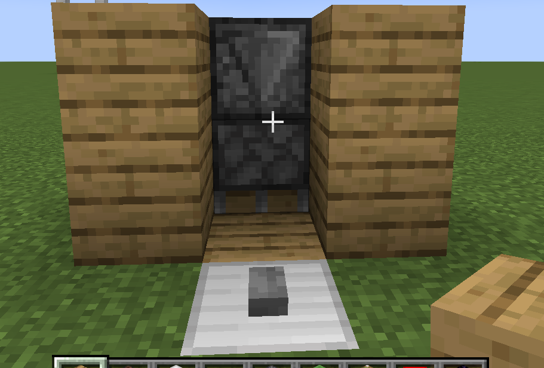
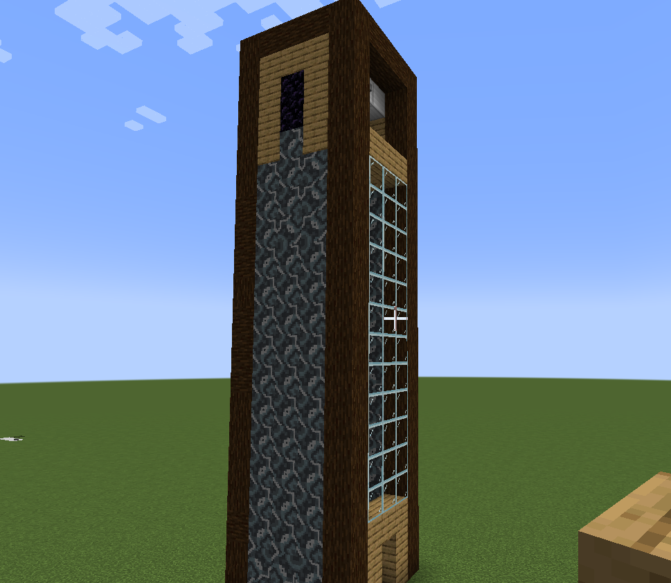

# Hvordan lage heis i minecraft
## Introduksjon
I denne veiledningen skal du lære deg hvordan du kan lage en fungerende heis i minecraft som kan transportere deg opp og ned med bare et knappetrykk. Den bruker grunnleggende redstone, som fungerer litt som elektrisitet i minecraft.

Veiledningen går ikke igjennom installering av minecraft, så den krever at du allerede har forkunnskap i hvordan du installerer og kjører minecraft. 

**NB: Brukerveiledningen er rettet mot Minecreaft Java Edition. Problemer kan forekomme om man prøver å følge den med Bedrock Edition på grunn av forskjelller i redstone funksjonalitet.**

## Kontroller
Om du ikke har spilt minecraft før, er dette de grunnleggende kontrollene du kan få bruk for for å følge veiledningen. Det anbefales allikevel litt erfaring for å klare å nøyaktig plassere blokkene for å bygge heisen.

### Bevegelse
1. Gå til venstre: **A**
2. Gå til høyre: **D**
3. Gå fremover: **W**
4. Gå bakover: **S**
5. Start å fly (i Kreativ modus): **DOBBELTKLIKK SPACE**
6. Fly oppover: **HOLD INNE SPACE**
7. Fly nedover: **HOLD INNE VENSTRE SHIFT**
8. Snik: **SHIFT**

### Navigasjon
1. Velg gjenstand i verktøyslinja: **TALLENE 1-9**
2. Åpne/lukke inventar: **E**
3. Åpne chat/kommandolinje **T**

### Intragere med verdenen
1. Knus blokk eller angrip mob(dyr og monstre): **VENSTREKLIKK**
2. Plasser blokk eller bruk gjenstand: **HØYREKLIKK**
3. Plasser blokk på brukbar gjenstand uten å bruke den: **SHIFT + HØYREKLIKK**

Her en en visuell oversikt over kontroller: 

---

## STEG 0 - OPPSETT
Dette er gjenstandene du trenger for å lage heisen. Veiledningen nevner ikke hvor mange du trenger av hver fordi den er rettet mot kreativ modus. 

1. Redstonepulver
2. Noteblokk
3. Jernblokk
4. Steinknapp
5. Observatør
6. Slimblokk
7. Klebrig stempel
8. En/flere valgfrie blokker (f.eks. eikeplanker)
9. Obsidian

## STEG 1 - Lag selve heisfunksjonen

1. Grav dette korset i bakken. Tallene representerer dybden på hullet.

2. Plasser redstonepulver langst de to blokkene nederst på korset
3. Plasser en noteblokk i det type hullet
4. Plasser en klebrig stempel på hver side av noteblokken. Den klissete siden skal vende opp.

**TIPS: For å plassere stempelet med den klissete siden opp, plasser den ovenifra.**

5. Plasser en jernblokk nederst på korset. Denne skal være på level med bakken, og ikke erstatte redstonepulveret.
6. Plasser en knapp over jernblokken. 
7. Plasser en observatør over noteblokken. Her skal den røde prikken rettes opp. 

**TIPS: For å la være å aktivere noteblokken må du enten klikke på SHIFT mens du står på bakken og plasserer observatøren, eller trykke på jordblokken over den.**

** NB: Ikke trykk på knappen før du får beskjed om det. Om du trykker på den for tidlig kan heisen skades fordi vi ikke har laget noe for å stoppe den enda.**

1. Plasser en slimblokk over observatøren og to slimblokker over hver av de klebrige stemplene. 
2. Plasser en klebrig stempel over observatøren. Denne skal peke nedover, slik at klisset er mot observatøren.
3.  Plasser en observatør over stempelet. Her skal den røde prikken peke mot stempelet, og "fjeset" skal opp.

**TIPS: Både stempelet og observatøren burde plasseres underifra, for eksempel fra hullet.**

## STEG 2 - BYGG EN RAMME FOR HEISEN
På de neste stegene kan en valgfri blokk utenom honnig og glasert terrakotta brukes med mindre noe annet blir sagt. Honnig og glasert terrakotta er unntak fordi de ikke fester seg til slim, og da fungerer ikke heisen. 

1. Plasser en blokk for å dekke det siste hullet i bakken. 
2. Plasser to blokker foran slimene.

1. Bygg opp bak heisen så høyt du ønsker at heisen skal være. Dette har ingen funksjonalitet, men blir en del av rammen. Har du allerede en vegg bak den er dette ikke nødvendig. 

**NB: La det være et mellomrom mellom slimblokkene og veggen bak. Hvis ikke kommer veggen til å feste seg til heisen og den fungerer ikke.**

2. Bygg en 5x5 kvadrat med et 3x3 hull for heisen. Dette blir gulvet rundt heisen. Du kan fylle ut utsiden av kvadraten som du ønsker, men la hullet og kvadraten være tom.

**NB: Her er det viktig at observatøren er i midten av kvadratet, hvis ikke fungerer det ikke. Om du ikke klarer å se om den er det, kan du for eksempel fylle inn kvadratet bortsett fra den midterste blokken. Du burde kunne fly rett opp fra observatøren til under hullet. Husk å knuse blokkene igjen.**

## STEG 3 - BYGG HEISSTOPPET
1. Bygg 4 blokker opp fra midten av baksiden av kvadraten.
2. Bygg derretter ut en blokk før du plasserer en obsidian slik at den er over midten av kvadratet, som også er over observatøren under.
3. Plasser en noteblokk under obsidianen. 

4. Plasser en jernblokk foran noteblokken, og deretter en ny blokk på hver side av hjernblokken
5. Plasser en knapp foran den midterste jernblokken.
6. Du kan nå også knuse blokkene du plasserte før obsidianen, fordi var mest for plasseringens skyld.

**TIPS: For å plassere jernblokken over noteblokken, stå på en blokk i nærheten og hold inne shift mens du trykker.**

7. Bygg veggene til heisen. Det er valgfritt hvilken blokker du bruker bortsett fra at du **MÅ plassere to obsidianblokker på høyre og venstre vegg slik som på bildet.**

**NB: Knus deretter blokkene under obsidianstripene slik som på bildet nedenfor.**

## STEG 4 - SISTE FINISH
Nå er heisens funksjonalitet ferdig, og du kan trykke på knappen om du ønsker å teste den. For å få den ned igjen, bare trykk på knappen i toppetasjen. 

Dette steget handler om å enkelt bygge selve utseendet til heisen. Her kan mye gjøres valgfritt, men pass på å følge det som står i den røde teksten, fordi om noe gjøres galt kan heisen ødelegges. 

1. Bygg blokker nedover veggen **foran**. Du kan for eksempel bruke glassblokker foran heisen. 

**NB: Ikke bygg veggene på siden uten videre instruksjon. Om feil blokker plasseres kan heisen stoppe fordi den setter seg fast i veggen.**

2. For å bygge veggene på siden, bruk en av de forskjellie blokkene som heter **glasert terrakotta**. Disse blokkene fester seg ikke til slimblokker, som gjør at heisen ikke setter seg fast i dem. Alternativt (fordi glasert terrakotta ikke har et utseende som passer til alt), kan du la det være tomt der og bygge veggen en blokk ut. **Det viktige er at ingen andre blokker enn glasert terrakotta skal direkte komme nær heisen.**

Bildet under er et eksempel på en vegg laget med glasert terrakotta. 

# Konklusjon
Nå er heisen ferdig. Den er litt humpete, men introduserer redstone og hva det for eksempel kan brukes til. 

Det er mye rom for å utforske hvordan man kan forbedre utseendet på heisen og tilpasse den til dine behov.